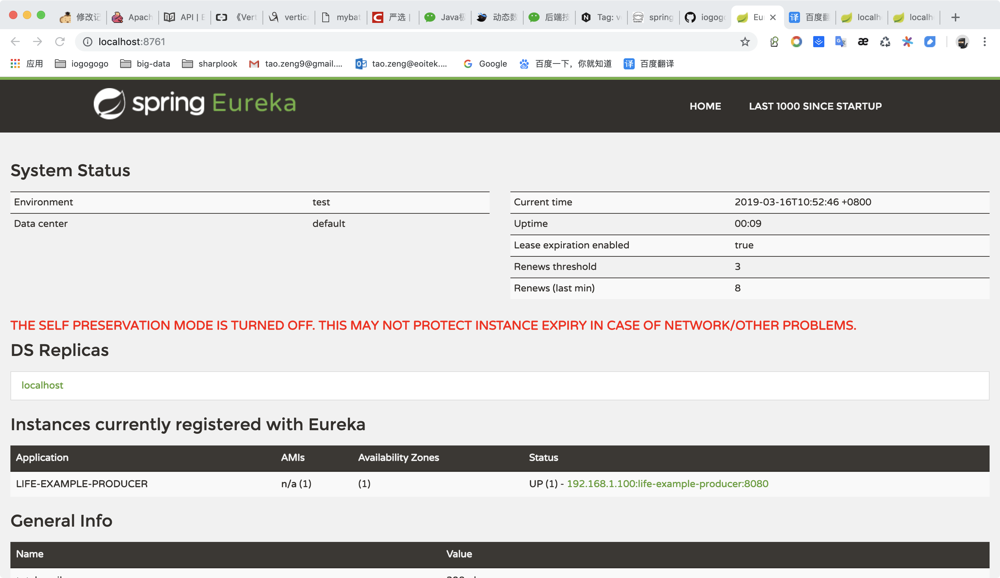

# 服务提供调用与熔断

之前我们介绍了eureka服务注册中心的搭建，这篇文章介绍一下如何使用eureka服务注册中心，搭建一个简单的服务端注册服务，客户端去调用服务使用的案例。


需要有三个角色：服务注册中心、服务提供者、服务消费者，其中服务注册中心就是我们上一篇的eureka单机版启动既可，流程是首先启动注册中心，服务提供者生产服务并注册到服务中心中，消费者从服务中心中获取服务并执行。


## 服务提供

我们假设服务提供者有一个hello方法，可以根据传入的参数，提供输出“hello xxx，this is first messge”的服务

### pom配置

创建一个springboot项目，pom.xml中添加如下配置，注:旧版的spring cloud和最新版的artifactId不太一样

```xml
<dependency>
    <groupId>org.springframework.boot</groupId>
    <artifactId>spring-boot-starter-web</artifactId>
</dependency>
<dependency>
    <groupId>org.springframework.cloud</groupId>
    <artifactId>spring-cloud-starter-netflix-eureka-client</artifactId>
</dependency>
<dependency>
    <groupId>org.springframework.cloud</groupId>
    <artifactId>spring-cloud-starter-netflix-hystrix</artifactId>
</dependency>
<dependency>
    <groupId>org.springframework.cloud</groupId>
    <artifactId>spring-cloud-starter-openfeign</artifactId>
</dependency>
```

### 配置文件

application.properties配置如下：

```properties
spring.application.name=life-example-producer
server.port=8080
eureka.instance.prefer-ip-address=true
eureka.client.service-url.defaultZone=http://localhost:8761/eureka/
# 这个配置是为了后面测试负载均衡
service.instance.name=这是服务器1
```

### 启动类

```java
package com.iogogogo.producer;

import feign.Retryer;
import org.springframework.boot.SpringApplication;
import org.springframework.boot.autoconfigure.SpringBootApplication;
import org.springframework.cloud.netflix.eureka.EnableEurekaClient;
import org.springframework.cloud.netflix.hystrix.EnableHystrix;
import org.springframework.context.annotation.Bean;

/**
 * Created by tao.zeng on 2019-03-16.
 */
@EnableHystrix
@EnableEurekaClient
@SpringBootApplication
public class ProducerApplication {

    public static void main(String[] args) {
        SpringApplication.run(ProducerApplication.class, args);
    }

    @Bean
    public Retryer feignRetryer() {
        // new Retryer.Default(100,TimeUnit.SECONDS.toMillis(1),5);//默认是5次
        return Retryer.NEVER_RETRY;
    }
}
```

### Controller

```java
package com.iogogogo.producer.api;

import org.springframework.beans.factory.annotation.Value;
import org.springframework.web.bind.annotation.GetMapping;
import org.springframework.web.bind.annotation.RequestMapping;
import org.springframework.web.bind.annotation.RestController;

import java.util.UUID;

/**
 * Created by tao.zeng on 2019-03-16.
 */
@RestController
@RequestMapping("/api")
public class IndexApi {


    @Value("${service.instance.name}")
    private String instanceName;

    @GetMapping("/index")
    public String index(String name) {
        return String.format("%s hello %s - %s", instanceName, name, UUID.randomUUID().toString());
    }
}
```


添加@EnableEurekaClient注解后，项目就具有了服务注册的功能。启动工程后，就可以在注册中心的页面看到service-producer服务。



到此服务提供者配置就完成了。


## 服务调用

### pom配置

和服务提供者一致

```xml
<dependency>
    <groupId>org.springframework.boot</groupId>
    <artifactId>spring-boot-starter-web</artifactId>
</dependency>
<dependency>
    <groupId>org.springframework.cloud</groupId>
    <artifactId>spring-cloud-starter-netflix-eureka-client</artifactId>
</dependency>
<dependency>
    <groupId>org.springframework.cloud</groupId>
    <artifactId>spring-cloud-starter-netflix-hystrix</artifactId>
</dependency>
<dependency>
    <groupId>org.springframework.cloud</groupId>
    <artifactId>spring-cloud-starter-openfeign</artifactId>
</dependency>
```

### 配置文件

application.properties配置如下：

```properties
spring.application.name=life-example-consumer
server.port=8081
eureka.instance.prefer-ip-address=true
eureka.client.service-url.defaultZone=http://localhost:8761/eureka/
# 开启熔断
feign.hystrix.enabled=true
```

### 启动类

```java
package com.iogogogo.consumer;

import org.springframework.boot.SpringApplication;
import org.springframework.boot.autoconfigure.SpringBootApplication;
import org.springframework.cloud.netflix.eureka.EnableEurekaClient;
import org.springframework.cloud.netflix.hystrix.EnableHystrix;
import org.springframework.cloud.netflix.hystrix.dashboard.EnableHystrixDashboard;
import org.springframework.cloud.openfeign.EnableFeignClients;

/**
 * Created by tao.zeng on 2019-03-16.
 */
@EnableHystrix
@EnableFeignClients
@EnableEurekaClient
@SpringBootApplication
@EnableHystrixDashboard
public class ConsumerApplication {

    public static void main(String[] args) {
        SpringApplication.run(ConsumerApplication.class, args);
    }
}
```

Feign是一个声明式Web Service客户端。使用Feign能让编写Web Service客户端更加简单, 它的使用方法是定义一个接口，然后在上面添加注解，同时也支持JAX-RS标准的注解。Feign也支持可拔插式的编码器和解码器。Spring Cloud对Feign进行了封装，使其支持了Spring MVC标准注解和HttpMessageConverters。Feign可以与Eureka和Ribbon组合使用以支持负载均衡。


### feign调用实现

```java
package com.iogogogo.consumer.feign;

import com.iogogogo.consumer.configure.FeignConfig;
import com.iogogogo.consumer.feign.fallback.ProducerFallback;
import org.springframework.cloud.openfeign.FeignClient;
import org.springframework.stereotype.Component;
import org.springframework.web.bind.annotation.RequestMapping;
import org.springframework.web.bind.annotation.RequestMethod;
import org.springframework.web.bind.annotation.RequestParam;

/**
 * value = 服务提供者的 spring.application.name
 * fallback = 熔断降级处理类
 * configuration = 熔断降级配置
 * <p>
 * Created by tao.zeng on 2019-03-16.
 */
@Component
@FeignClient(value = "life-example-producer", fallback = ProducerFallback.class, configuration = FeignConfig.class)
public interface ProducerService {

    /**
     * 调用的远程方法路由地址需要和服务提供者的一致，并且不要使用GetMapping之类的简化方法
     *
     * @param name
     * @return
     */
    @RequestMapping(value = "/api/index", method = RequestMethod.GET)
    String index(@RequestParam("name") String name);

}
```


### 消费者调用远程服务

````java
package com.iogogogo.consumer.api;

import com.iogogogo.consumer.feign.ProducerService;
import org.springframework.beans.factory.annotation.Autowired;
import org.springframework.web.bind.annotation.RequestMapping;
import org.springframework.web.bind.annotation.RestController;

/**
 * Created by tao.zeng on 2019-03-16.
 */
@RestController
@RequestMapping("/api/consumer")
public class IndexApi {

    @Autowired
    private ProducerService producerService;

    @RequestMapping("/index")
    public String index(String name) {
        return producerService.index(name);
    }
}
````

到此，最简单的一个服务注册与调用的例子就完成了。


## 测试

### 启动服务

依次启动cloud-eureka、service-producer、service-consumer三个项目，并且查看eureka注册情况


### 测试服务提供者

浏览器输入服务提供者路由地址查看是否正常
```html
http://localhost:8080/api/index?name=sharplook
```

返回结果

```json
hello sharplook - 7359bd06-8471-4a5d-aa04-7b25b7c13ddb
```

说明service-producer正常启动，提供的服务也正常。


### 测试服务调用者

浏览器输入调用者路由地址，并传递相应的参数

```html
http://localhost:8081/api/consumer/index?name=小花脸
```

返回结果

```json
hello 小花脸 - f012cf85-9a04-4ae0-b879-42fa860d5015
```

说明客户端已经成功的通过feign调用了远程服务，并且将结果返回到了浏览器。


### 负载均衡

前面在服务提供者的application.properties文件中配置了一个service.instance.name属性，现在讲程序打包，然后输入不同的instance名称，用来模拟多个服务器

依次启动多个service-producer实例，使用不同的端口以及自定义的service.instance.name

```shell
java -jar service-producer-0.0.1.jar --server.port=8080 --service.instance.name=这是服务器1

java -jar service-producer-0.0.1.jar --server.port=8081 --service.instance.name=这是服务器2

java -jar service-producer-0.0.1.jar --server.port=8082 --service.instance.name=这是服务器3
```

启动完成后，会看到eureka中有多个服务提供者


然后次使用服务消费者去调用

```
http://localhost:8081/api/consumer/index?name=小花脸
```

第一次返回结果：

```
这是服务器1 hello 小花脸 - c280ad85-8475-464e-9856-151c70b8970d
```

第二次返回结果：

```
这是服务器2 hello 小花脸 - 4e798f0a-7fda-4063-bb33-bbaaad106f05
```

第三次返回结果：

```
这是服务器3 hello 小花脸 - a318c789-9765-4119-a991-b77c72a19ba3
```


不断的进行测试下去会发现两种结果交替出现，说明两个服务中心自动提供了服务均衡负载的功能。如果我们将服务提供者的数量在提高为N个，测试结果一样，请求会自动轮询到每个服务端来处理。


## 服务熔断

### 熔断器

#### 雪崩效应

在微服务架构中通常会有多个服务层调用，基础服务的故障可能会导致级联故障，进而造成整个系统不可用的情况，这种现象被称为服务雪崩效应。服务雪崩效应是一种因“服务提供者”的不可用导致“服务消费者”的不可用,并将不可用逐渐放大的过程。

如果下图所示：A作为服务提供者，B为A的服务消费者，C和D是B的服务消费者。A不可用引起了B的不可用，并将不可用像滚雪球一样放大到C和D时，雪崩效应就形成了。


#### 熔断器（CircuitBreaker）

熔断器的原理很简单，如同电力过载保护器。它可以实现快速失败，如果它在一段时间内侦测到许多类似的错误，会强迫其以后的多个调用快速失败，不再访问远程服务器，从而防止应用程序不断地尝试执行可能会失败的操作，使得应用程序继续执行而不用等待修正错误，或者浪费CPU时间去等到长时间的超时产生。熔断器也可以使应用程序能够诊断错误是否已经修正，如果已经修正，应用程序会再次尝试调用操作。

熔断器模式就像是那些容易导致错误的操作的一种代理。这种代理能够记录最近调用发生错误的次数，然后决定使用允许操作继续，或者立即返回错误。 熔断器开关相互转换的逻辑如下图：


熔断器就是保护服务高可用的最后一道防线。

#### Hystrix特性

**1.断路器机制**

断路器很好理解, 当Hystrix Command请求后端服务失败数量超过一定比例(默认50%), 断路器会切换到开路状态(Open). 这时所有请求会直接失败而不会发送到后端服务. 断路器保持在开路状态一段时间后(默认5秒), 自动切换到半开路状态(HALF-OPEN). 这时会判断下一次请求的返回情况, 如果请求成功, 断路器切回闭路状态(CLOSED), 否则重新切换到开路状态(OPEN). Hystrix的断路器就像我们家庭电路中的保险丝, 一旦后端服务不可用, 断路器会直接切断请求链, 避免发送大量无效请求影响系统吞吐量, 并且断路器有自我检测并恢复的能力.

**2.Fallback**

Fallback相当于是降级操作. 对于查询操作, 我们可以实现一个fallback方法, 当请求后端服务出现异常的时候, 可以使用fallback方法返回的值. fallback方法的返回值一般是设置的默认值或者来自缓存.

**3.资源隔离**

在Hystrix中, 主要通过线程池来实现资源隔离. 通常在使用的时候我们会根据调用的远程服务划分出多个线程池. 例如调用产品服务的Command放入A线程池, 调用账户服务的Command放入B线程池. 这样做的主要优点是运行环境被隔离开了. 这样就算调用服务的代码存在bug或者由于其他原因导致自己所在线程池被耗尽时, 不会对系统的其他服务造成影响. 但是带来的代价就是维护多个线程池会对系统带来额外的性能开销. 如果是对性能有严格要求而且确信自己调用服务的客户端代码不会出问题的话, 可以使用Hystrix的信号模式(Semaphores)来隔离资源.


### Feign Hystrix

因为熔断只是作用在服务调用这一端，因此我们根据上一篇的示例代码只需要改动service-consumer项目相关代码就可以。因为，Feign中已经依赖了Hystrix所以在maven配置上不用做任何改动。

#### 配置文件

```properties
feign.hystrix.enabled=true
```

#### 熔断降级处理类

```java
package com.iogogogo.consumer.feign.fallback;

import com.iogogogo.consumer.feign.ProducerService;
import org.springframework.stereotype.Component;

/**
 * Created by tao.zeng on 2019-03-16.
 */
@Component
public class ProducerFallback implements ProducerService {

    @Override
    public String index(String name) {
        return String.format("life-example-producer 服务不可用 param:%s", name);
    }
}
```

#### fallback属性

```java
package com.iogogogo.consumer.feign;

import com.iogogogo.consumer.configure.FeignConfig;
import com.iogogogo.consumer.feign.fallback.ProducerFallback;
import org.springframework.cloud.openfeign.FeignClient;
import org.springframework.stereotype.Component;
import org.springframework.web.bind.annotation.RequestMapping;
import org.springframework.web.bind.annotation.RequestMethod;
import org.springframework.web.bind.annotation.RequestParam;

/**
 * value = 服务提供者的 spring.application.name
 * fallback = 熔断降级处理类
 * configuration = 熔断降级配置
 * <p>
 * Created by tao.zeng on 2019-03-16.
 */
@Component
@FeignClient(value = "life-example-producer", fallback = ProducerFallback.class, configuration = FeignConfig.class)
public interface ProducerService {

    /**
     * 调用的远程方法路由地址需要和服务提供者的一致，并且不要使用GetMapping之类的简化方法
     *
     * @param name
     * @return
     */
    @RequestMapping(value = "/api/index", method = RequestMethod.GET)
    String index(@RequestParam("name") String name);

}
```

### 测试

依次启动cloud-eureka、service-producer、service-consumer三个项目，手动停掉服务查看熔断结果