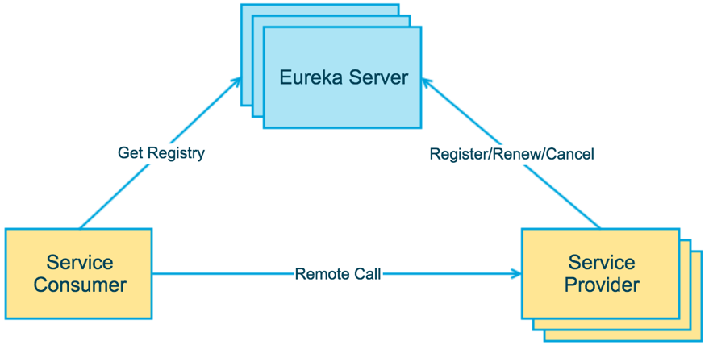

# 引言

## 文章部分参考或摘自

 [纯洁的微笑](http://www.ityouknow.com/)

[程序猿DD](http://blog.didispace.com/)

[猿天地](http://cxytiandi.com/)

[方志朋的博客](https://www.fangzhipeng.com/)

[iogogogo](https://iogogogo.github.io/)


## 案例中所有服务的端口规划

|        服务名         |       端口       |    说明    |
| :-------------------: | :--------------: | :--------: |
|     cloud-eureka      |       8761       |  注册中心  |
|      cloud-zuul       |       8888       |  服务网关  |
|     cloud-config      |       8899       |  配置中心  |
| life-example-producer | 8080、8082、8083 | 服务提供者 |
| life-example-consumer |       8081       | 服务消费者 |


# 大话Spring Cloud？

Spring Cloud是一系列框架的有序集合。它利用Spring Boot的开发便利性巧妙地简化了分布式系统基础设施的开发，如服务发现注册、配置中心、消息总线、负载均衡、断路器、数据监控等，都可以用Spring Boot的开发风格做到一键启动和部署。Spring并没有重复制造轮子，它只是将目前各家公司开发的比较成熟、经得起实际考验的服务框架组合起来，通过Spring Boot风格进行再封装屏蔽掉了复杂的配置和实现原理，最终给开发者留出了一套简单易懂、易部署和易维护的分布式系统开发工具包。

微服务是可以独立部署、水平扩展、独立访问（或者有独立的数据库）的服务单元，springcloud就是这些微服务的大管家，采用了微服务这种架构之后，项目的数量会非常多，springcloud做为大管家需要管理好这些微服务，自然需要很多小弟来帮忙。

主要的小弟有：Spring Cloud Config、Spring Cloud Netflix（Eureka、Hystrix、Zuul、Archaius…）、Spring Cloud Bus、Spring Cloud for Cloud Foundry、Spring Cloud Cluster、Spring Cloud Consul、Spring Cloud Security、Spring Cloud Sleuth、Spring Cloud Data Flow、Spring Cloud Stream、Spring Cloud Task、Spring Cloud Zookeeper、Spring Cloud Connectors、Spring Cloud Starters、Spring Cloud CLI，每个小弟身怀独门绝技武功高强下面来做一一介绍。


## 核心成员

### Spring Cloud Netflix

这可是个大boss，地位仅次于老大，老大各项服务依赖与它，与各种Netflix OSS组件集成，组成微服务的核心，它的小弟主要有Eureka, Hystrix, Zuul, Archaius… 太多了

#### Netflix Eureka

服务中心，云端服务发现，一个基于 REST 的服务，用于定位服务，以实现云端中间层服务发现和故障转移。这个可是springcloud最牛鼻的小弟，服务中心，任何小弟需要其它小弟支持什么都需要从这里来拿，同样的你有什么独门武功的都赶紧过报道，方便以后其它小弟来调用；它的好处是你不需要直接找各种什么小弟支持，只需要到服务中心来领取，也不需要知道提供支持的其它小弟在哪里，还是几个小弟来支持的，反正拿来用就行，服务中心来保证稳定性和质量。


#### Netflix Hystrix

熔断器，容错管理工具，旨在通过熔断机制控制服务和第三方库的节点,从而对延迟和故障提供更强大的容错能力。比如突然某个小弟生病了，但是你还需要它的支持，然后调用之后它半天没有响应，你却不知道，一直在等等这个响应；有可能别的小弟也正在调用你的武功绝技，那么当请求多之后，就会发生严重的阻塞影响老大的整体计划。这个时候Hystrix就派上用场了，当Hystrix发现某个小弟不在状态不稳定立马马上让它下线，让其它小弟来顶上来，或者给你说不用等了这个小弟今天肯定不行，该干嘛赶紧干嘛去别在这排队了。


#### Netflix Zuul

Zuul 是在云平台上提供动态路由,监控,弹性,安全等边缘服务的框架。Zuul 相当于是设备和 Netflix 流应用的 Web 网站后端所有请求的前门。当其它门派来找大哥办事的时候一定要先经过zuul,看下有没有带刀子什么的给拦截回去，或者是需要找那个小弟的直接给带过去。


#### Netflix Archaius

配置管理API，包含一系列配置管理API，提供动态类型化属性、线程安全配置操作、轮询框架、回调机制等功能。可以实现动态获取配置，原理是每隔60s（默认，可配置）从配置源读取一次内容，这样修改了配置文件后不需要重启服务就可以使修改后的内容生效，前提使用archaius的API来读取。


### Spring Cloud Config

俗称的配置中心，配置管理工具包，让你可以把配置放到远程服务器，集中化管理集群配置，目前支持本地存储、Git以及Subversion。就是以后大家武器、枪火什么的东西都集中放到一起，别随便自己带，方便以后统一管理、升级装备。


### Spring Cloud Bus

事件、消息总线，用于在集群（例如，配置变化事件）中传播状态变化，可与Spring Cloud Config联合实现热部署。相当于水浒传中日行八百里的神行太保戴宗，确保各个小弟之间消息保持畅通。


### Spring Cloud for Cloud Foundry

Cloud Foundry是VMware推出的业界第一个开源PaaS云平台，它支持多种框架、语言、运行时环境、云平台及应用服务，使开发人员能够在几秒钟内进行应用程序的部署和扩展，无需担心任何基础架构的问题

其实就是与CloudFoundry进行集成的一套解决方案，抱了Cloud Foundry的大腿。


### Spring Cloud Cluster

Spring Cloud Cluster将取代Spring Integration。提供在分布式系统中的集群所需要的基础功能支持，如：选举、集群的状态一致性、全局锁、tokens等常见状态模式的抽象和实现。

如果把不同的帮派组织成统一的整体，Spring Cloud Cluster已经帮你提供了很多方便组织成统一的工具。


### Spring Cloud Consul

Consul 是一个支持多数据中心分布式高可用的服务发现和配置共享的服务软件,由 HashiCorp 公司用 Go 语言开发, 基于 Mozilla Public License 2.0 的协议进行开源. Consul 支持健康检查,并允许 HTTP 和 DNS 协议调用 API 存储键值对.

Spring Cloud Consul 封装了Consul操作，consul是一个服务发现与配置工具，与Docker容器可以无缝集成。


## 其它小弟

### Spring Cloud Security

基于spring security的安全工具包，为你的应用程序添加安全控制。这个小弟很牛鼻专门负责整个帮派的安全问题，设置不同的门派访问特定的资源，不能把秘籍葵花宝典泄漏了。


### Spring Cloud Sleuth

日志收集工具包，封装了Dapper和log-based追踪以及Zipkin和HTrace操作，为SpringCloud应用实现了一种分布式追踪解决方案。


### Spring Cloud Data Flow

- Data flow 是一个用于开发和执行大范围数据处理其模式包括ETL，批量运算和持续运算的统一编程模型和托管服务。
- 对于在现代运行环境中可组合的微服务程序来说，Spring Cloud data flow是一个原生云可编配的服务。使用Spring Cloud data flow，开发者可以为像数据抽取，实时分析，和数据导入/导出这种常见用例创建和编配数据通道 （data pipelines）。
- Spring Cloud data flow 是基于原生云对 spring XD的重新设计，该项目目标是简化大数据应用的开发。Spring XD 的流处理和批处理模块的重构分别是基于 Spring Boot的stream 和 task/batch 的微服务程序。这些程序现在都是自动部署单元而且他们原生的支持像 Cloud Foundry、Apache YARN、Apache Mesos和Kubernetes 等现代运行环境。
- Spring Cloud data flow 为基于微服务的分布式流处理和批处理数据通道提供了一系列模型和最佳实践。


### Spring Cloud Stream

Spring Cloud Stream是创建消息驱动微服务应用的框架。Spring Cloud Stream是基于Spring Boot创建，用来建立单独的／工业级spring应用，使用spring integration提供与消息代理之间的连接。数据流操作开发包，封装了与Redis,Rabbit、Kafka等发送接收消息。

一个业务会牵扯到多个任务，任务之间是通过事件触发的，这就是Spring Cloud stream要干的事了


### Spring Cloud Task

Spring Cloud Task 主要解决短命微服务的任务管理，任务调度的工作，比如说某些定时任务晚上就跑一次，或者某项数据分析临时就跑几次。


### Spring Cloud Zookeeper

ZooKeeper是一个分布式的，开放源码的分布式应用程序协调服务，是Google的Chubby一个开源的实现，是Hadoop和Hbase的重要组件。它是一个为分布式应用提供一致性服务的软件，提供的功能包括：配置维护、域名服务、分布式同步、组服务等。ZooKeeper的目标就是封装好复杂易出错的关键服务，将简单易用的接口和性能高效、功能稳定的系统提供给用户。

操作Zookeeper的工具包，用于使用zookeeper方式的服务发现和配置管理，抱了Zookeeper的大腿。


### Spring Cloud Connectors

Spring Cloud Connectors 简化了连接到服务的过程和从云平台获取操作的过程，有很强的扩展性，可以利用Spring Cloud Connectors来构建你自己的云平台。

便于云端应用程序在各种PaaS平台连接到后端，如：数据库和消息代理服务。


### Spring Cloud Starters

Spring Boot式的启动项目，为Spring Cloud提供开箱即用的依赖管理。


### Spring Cloud CLI

基于 Spring Boot CLI，可以让你以命令行方式快速建立云组件。


## 和Spring Boot 是什么关系

Spring Boot 是 Spring 的一套快速配置脚手架，可以基于Spring Boot 快速开发单个微服务，Spring Cloud是一个基于Spring Boot实现的云应用开发工具；Spring Boot专注于快速、方便集成的单个个体，Spring Cloud是关注全局的服务治理框架；Spring Boot使用了默认大于配置的理念，很多集成方案已经帮你选择好了，能不配置就不配置，Spring Cloud很大的一部分是基于Spring Boot来实现,可以不基于Spring Boot吗？不可以。

Spring Boot可以离开Spring Cloud独立使用开发项目，但是Spring Cloud离不开Spring Boot，属于依赖的关系。

spring -> spring boot > Spring Cloud 这样的关系。


## Spring Cloud的优势

微服务的框架那么多比如：dubbo、Kubernetes，为什么就要使用Spring Cloud的呢？

- 产出于spring大家族，spring在企业级开发框架中无人能敌，来头很大，可以保证后续的更新、完善。比如dubbo现在就差不多死了
- 有Spring Boot 这个独立干将可以省很多事，大大小小的活Spring Boot都搞的挺不错。
- 作为一个微服务治理的大家伙，考虑的很全面，几乎服务治理的方方面面都考虑到了，方便开发开箱即用。
- Spring Cloud 活跃度很高，教程很丰富，遇到问题很容易找到解决方案
- 轻轻松松几行代码就完成了熔断、均衡负载、服务中心的各种平台功能

Spring Cloud对于中小型互联网公司来说是一种福音，因为这类公司往往没有实力或者没有足够的资金投入去开发自己的分布式系统基础设施，使用Spring Cloud一站式解决方案能在从容应对业务发展的同时大大减少开发成本。同时，随着近几年微服务架构和Docker容器概念的火爆，也会让Spring Cloud在未来越来越“云”化的软件开发风格中立有一席之地，尤其是在目前五花八门的分布式解决方案中提供了标准化的、全站式的技术方案，意义可能会堪比当前Servlet规范的诞生，有效推进服务端软件系统技术水平的进步。


## Spring Cloud基础组件架构


# Eureka 注册中心

Eureka是Netflix开源的一款提供服务注册和发现的产品，它提供了完整的Service Registry和Service Discovery实现。也是springcloud体系中最重要最核心的组件之一。


## 背景介绍

### 服务中心

服务中心又称注册中心，管理各种服务功能包括服务的注册、发现、熔断、负载、降级等，比如dubbo admin后台的各种功能。

有了服务中心调用关系会有什么变化，画几个简图来帮忙理解

项目A调用项目B

正常调用项目A请求项目B


有了服务中心之后，任何一个服务都不能直接去掉用，都需要通过服务中心来调用


项目A调用项目B，项目B在调用项目C


这时候调用的步骤就会为两步：第一步，项目A首先从服务中心请求项目B服务器，然后项目B在从服务中心请求项目C服务。


上面的项目只是两三个相互之间的简单调用，但是如果项目超过20个30个呢，比如目前itoa组件大概有8个服务，
项目之间很多地方相互调用，任何其中的一个项目改动，就会牵连好几个项目跟着重启，巨麻烦而且容易出错。通过服务中心来获取服务你不需要关注你调用的项目IP地址，由几台服务器组成，每次直接去服务中心获取可以使用的服务去调用既可。


由于各种服务都注册到了服务中心，就有了去做很多高级功能条件。比如几台服务提供相同服务来做均衡负载；监控服务器调用成功率来做熔断，移除服务列表中的故障点；监控服务调用时间来对不同的服务器设置不同的权重等等。


### Netflix

网飞 全球十大视频网站中唯一收费站点 以下介绍来自于百度百科：

> Netflix是一家美国公司，在美国、加拿大提供互联网随选流媒体播放，定制DVD、蓝光光碟在线出租业务。该公司成立于1997年，总部位于加利福尼亚州洛斯盖图，1999年开始订阅服务。2009年，该公司可提供多达10万部DVD电影，并有1千万的订户。2007年2月25日，Netflix宣布已经售出第10亿份DVD。HIS一份报告中表示，2011年Netflix网络电影销量占据美国用户在线电影总销量的45%。


Netflix的开源框架组件已经在Netflix的大规模分布式微服务环境中经过多年的生产实战验证，正逐步被社区接受为构造微服务框架的标准组件。Spring Cloud开源产品，主要是基于对Netflix开源组件的进一步封装，方便Spring开发人员构建微服务基础框架。对于一些打算构建微服务框架体系的公司来说，充分利用或参考借鉴Netflix的开源微服务组件(或Spring Cloud)，在此基础上进行必要的企业定制，无疑是通向微服务架构的捷径。


### Eureka

按照官方介绍：

> Eureka is a REST (Representational State Transfer) based service that is primarily used in the AWS cloud for locating services for the purpose of load balancing and failover of middle-tier servers.
>
> Eureka 是一个基于 REST 的服务，主要在 AWS 云中使用, 定位服务来进行中间层服务器的负载均衡和故障转移。


Spring Cloud 封装了 Netflix 公司开发的 Eureka 模块来实现服务注册和发现。Eureka 采用了 C-S 的设计架构。Eureka Server 作为服务注册功能的服务器，它是服务注册中心。而系统中的其他微服务，使用 Eureka 的客户端连接到 Eureka Server，并维持心跳连接。这样系统的维护人员就可以通过 Eureka Server 来监控系统中各个微服务是否正常运行。Spring Cloud 的一些其他模块（比如Zuul）就可以通过 Eureka Server 来发现系统中的其他微服务，并执行相关的逻辑。


Eureka由两个组件组成：Eureka服务器和Eureka客户端。Eureka服务器用作服务注册服务器。Eureka客户端是一个java客户端，用来简化与服务器的交互、作为轮询负载均衡器，并提供服务的故障切换支持。Netflix在其生产环境中使用的是另外的客户端，它提供基于流量、资源利用率以及出错状态的加权负载均衡。


用一张图来认识以下：



上图简要描述了Eureka的基本架构，由3个角色组成：


1、Eureka Server

- 提供服务注册和发现

2、Service Provider

- 服务提供方
- 将自身服务注册到Eureka，从而使服务消费方能够找到

3、Service Consumer

- 服务消费方
- 从Eureka获取注册服务列表，从而能够消费服务


## 案例实践

### Eureka Server


spring cloud已经帮我实现了服务注册中心，我们只需要很简单的几个步骤就可以完成。

1、pom中添加依赖

```xml
<dependency>
    <groupId>org.springframework.cloud</groupId>
    <artifactId>spring-cloud-starter-netflix-eureka-server</artifactId>
</dependency>
```

2、添加启动代码中添加@EnableEurekaServer注解

```java
package com.iogogogo.eureka;

import lombok.extern.slf4j.Slf4j;
import org.springframework.boot.SpringApplication;
import org.springframework.boot.autoconfigure.SpringBootApplication;
import org.springframework.cloud.netflix.eureka.server.EnableEurekaServer;

/**
 * Created by tao.zeng on 2019-03-15.
 */
@Slf4j
@EnableEurekaServer
@SpringBootApplication
public class EurekaServerApplication {

    public static void main(String[] args) {
        SpringApplication.run(EurekaServerApplication.class, args);
    }
}
```

3、配置文件

在默认设置下，该服务注册中心也会将自己作为客户端来尝试注册它自己，所以我们需要禁用它的客户端注册行为，在application.properties添加以下配置：

```properties
spring.application.name=life-cloud-eureka
server.port=8761
eureka.instance.hostname=localhost
# 实例名称显示IP
eureka.instance.prefer-ip-address=true
# 健康检查
eureka.server.enable-self-preservation=false
# 清理间隔
eureka.server.eviction-interval-timer-in-ms=6000
# 表示是否将自己注册到Eureka Server，默认为true。
eureka.client.register-with-eureka=false
# 表示是否从Eureka Server获取注册信息，默认为true。
eureka.client.fetch-registry=false
# eureka服务地址 多个地址可使用 , 分隔。
eureka.client.service-url.defaultZone=http://${eureka.instance.hostname}:${server.port}/eureka/
```


### eureka集群使用

注册中心这么关键的服务，如果是单点话，遇到故障就是毁灭性的。在生产中我们可能需要三台或者大于三台的注册中心来保证服务的稳定性，在一个分布式系统中，服务注册中心是最重要的基础部分，理应随时处于可以提供服务的状态。为了维持其可用性，使用集群是很好的解决方案。Eureka通过互相注册的方式来实现高可用的部署，所以我们只需要将Eureke Server配置其他可用的serviceUrl就能实现高可用部署。


- 修改hosts文件

```shell
127.0.0.1 peer1  
127.0.0.1 peer2  
127.0.0.1 peer3  
```

- 创建 application-peer1.properties 将serviceUrl指向peer2、peer3

```properties
spring.application.name=life-cloud-eureka
server.port=8761
eureka.instance.hostname=peer1
# 实例名称显示IP
eureka.instance.prefer-ip-address=true
# 健康检查
eureka.server.enable-self-preservation=false
# 清理间隔
eureka.server.eviction-interval-timer-in-ms=6000
# 表示是否将自己注册到Eureka Server，默认为true。
eureka.client.register-with-eureka=false
# 表示是否从Eureka Server获取注册信息，默认为true。
eureka.client.fetch-registry=false
# eureka服务地址 多个地址可使用 , 分隔。
eureka.client.service-url.defaultZone=http://peer2:8762/eureka/,http://peer3:8763/eureka/
```

- 创建 application-peer2.properties 将serviceUrl指向peer1、peer3

```properties
spring.application.name=life-cloud-eureka
server.port=8762
eureka.instance.hostname=peer2
# 实例名称显示IP
eureka.instance.prefer-ip-address=true
# 健康检查
eureka.server.enable-self-preservation=false
# 清理间隔
eureka.server.eviction-interval-timer-in-ms=6000
# 表示是否将自己注册到Eureka Server，默认为true。
eureka.client.register-with-eureka=false
# 表示是否从Eureka Server获取注册信息，默认为true。
eureka.client.fetch-registry=false
# eureka服务地址 多个地址可使用 , 分隔。
eureka.client.service-url.defaultZone=http://peer1:8761/eureka/,http://peer3:8763/eureka/
```

- 创建 application-peer3.properties 将serviceUrl指向peer1、peer2

```properties
spring.application.name=life-cloud-eureka
server.port=8763
eureka.instance.hostname=peer3
# 实例名称显示IP
eureka.instance.prefer-ip-address=true
# 健康检查
eureka.server.enable-self-preservation=false
# 清理间隔
eureka.server.eviction-interval-timer-in-ms=6000
# 表示是否将自己注册到Eureka Server，默认为true。
eureka.client.register-with-eureka=false
# 表示是否从Eureka Server获取注册信息，默认为true。
eureka.client.fetch-registry=false
# eureka服务地址 多个地址可使用 , 分隔。
eureka.client.service-url.defaultZone=http://peer1:8761/eureka/,http://peer2:8762/eureka/
```

- 打包

```shell
mvn clean package
```

- 依次启动

```shell
java -jar cloud-eureka-0.0.1.jar --spring.profiles.active=peer1
java -jar cloud-eureka-0.0.1.jar --spring.profiles.active=peer2
java -jar cloud-eureka-0.0.1.jar --spring.profiles.active=peer3

```


启动完成后，浏览器输入：http://localhost:8762/ 效果图如下：


可以在peer2中看到了peer1、peer3的相关信息。至此eureka集群也已经完成了


# 服务提供调用与熔断

之前我们介绍了eureka服务注册中心的搭建，这篇文章介绍一下如何使用eureka服务注册中心，搭建一个简单的服务端注册服务，客户端去调用服务使用的案例。


需要有三个角色：服务注册中心、服务提供者、服务消费者，其中服务注册中心就是我们上一篇的eureka单机版启动既可，流程是首先启动注册中心，服务提供者生产服务并注册到服务中心中，消费者从服务中心中获取服务并执行。


## 服务提供

我们假设服务提供者有一个hello方法，可以根据传入的参数，提供输出“hello xxx，this is first messge”的服务

### pom配置

创建一个springboot项目，pom.xml中添加如下配置，注:旧版的spring cloud和最新版的artifactId不太一样

```xml
<dependency>
    <groupId>org.springframework.boot</groupId>
    <artifactId>spring-boot-starter-web</artifactId>
</dependency>
<dependency>
    <groupId>org.springframework.cloud</groupId>
    <artifactId>spring-cloud-starter-netflix-eureka-client</artifactId>
</dependency>
<dependency>
    <groupId>org.springframework.cloud</groupId>
    <artifactId>spring-cloud-starter-netflix-hystrix</artifactId>
</dependency>
<dependency>
    <groupId>org.springframework.cloud</groupId>
    <artifactId>spring-cloud-starter-openfeign</artifactId>
</dependency>
```

### 配置文件

application.properties配置如下：

```properties
spring.application.name=life-example-producer
server.port=8080
eureka.instance.prefer-ip-address=true
eureka.client.service-url.defaultZone=http://localhost:8761/eureka/
# 这个配置是为了后面测试负载均衡
service.instance.name=这是服务器1
```

### 启动类

```java
package com.iogogogo.producer;

import feign.Retryer;
import org.springframework.boot.SpringApplication;
import org.springframework.boot.autoconfigure.SpringBootApplication;
import org.springframework.cloud.netflix.eureka.EnableEurekaClient;
import org.springframework.cloud.netflix.hystrix.EnableHystrix;
import org.springframework.context.annotation.Bean;

/**
 * Created by tao.zeng on 2019-03-16.
 */
@EnableHystrix
@EnableEurekaClient
@SpringBootApplication
public class ProducerApplication {

    public static void main(String[] args) {
        SpringApplication.run(ProducerApplication.class, args);
    }

    @Bean
    public Retryer feignRetryer() {
        // new Retryer.Default(100,TimeUnit.SECONDS.toMillis(1),5);//默认是5次
        return Retryer.NEVER_RETRY;
    }
}
```

### Controller

```java
package com.iogogogo.producer.api;

import org.springframework.beans.factory.annotation.Value;
import org.springframework.web.bind.annotation.GetMapping;
import org.springframework.web.bind.annotation.RequestMapping;
import org.springframework.web.bind.annotation.RestController;

import java.util.UUID;

/**
 * Created by tao.zeng on 2019-03-16.
 */
@RestController
@RequestMapping("/api")
public class IndexApi {


    @Value("${service.instance.name}")
    private String instanceName;

    @GetMapping("/index")
    public String index(String name) {
        return String.format("%s hello %s - %s", instanceName, name, UUID.randomUUID().toString());
    }
}
```


添加@EnableEurekaClient注解后，项目就具有了服务注册的功能。启动工程后，就可以在注册中心的页面看到service-producer服务。


到此服务提供者配置就完成了。


## 服务调用

### pom配置

和服务提供者一致

```xml
<dependency>
    <groupId>org.springframework.boot</groupId>
    <artifactId>spring-boot-starter-web</artifactId>
</dependency>
<dependency>
    <groupId>org.springframework.cloud</groupId>
    <artifactId>spring-cloud-starter-netflix-eureka-client</artifactId>
</dependency>
<dependency>
    <groupId>org.springframework.cloud</groupId>
    <artifactId>spring-cloud-starter-netflix-hystrix</artifactId>
</dependency>
<dependency>
    <groupId>org.springframework.cloud</groupId>
    <artifactId>spring-cloud-starter-openfeign</artifactId>
</dependency>
```

### 配置文件

application.properties配置如下：

```properties
spring.application.name=life-example-consumer
server.port=8081
eureka.instance.prefer-ip-address=true
eureka.client.service-url.defaultZone=http://localhost:8761/eureka/
# 开启熔断
feign.hystrix.enabled=true
```

### 启动类

```java
package com.iogogogo.consumer;

import org.springframework.boot.SpringApplication;
import org.springframework.boot.autoconfigure.SpringBootApplication;
import org.springframework.cloud.netflix.eureka.EnableEurekaClient;
import org.springframework.cloud.netflix.hystrix.EnableHystrix;
import org.springframework.cloud.netflix.hystrix.dashboard.EnableHystrixDashboard;
import org.springframework.cloud.openfeign.EnableFeignClients;

/**
 * Created by tao.zeng on 2019-03-16.
 */
@EnableHystrix
@EnableFeignClients
@EnableEurekaClient
@SpringBootApplication
@EnableHystrixDashboard
public class ConsumerApplication {

    public static void main(String[] args) {
        SpringApplication.run(ConsumerApplication.class, args);
    }
}
```

Feign是一个声明式Web Service客户端。使用Feign能让编写Web Service客户端更加简单, 它的使用方法是定义一个接口，然后在上面添加注解，同时也支持JAX-RS标准的注解。Feign也支持可拔插式的编码器和解码器。Spring Cloud对Feign进行了封装，使其支持了Spring MVC标准注解和HttpMessageConverters。Feign可以与Eureka和Ribbon组合使用以支持负载均衡。


### feign调用实现

```java
package com.iogogogo.consumer.feign;

import com.iogogogo.consumer.configure.FeignConfig;
import com.iogogogo.consumer.feign.fallback.ProducerFallback;
import org.springframework.cloud.openfeign.FeignClient;
import org.springframework.stereotype.Component;
import org.springframework.web.bind.annotation.RequestMapping;
import org.springframework.web.bind.annotation.RequestMethod;
import org.springframework.web.bind.annotation.RequestParam;

/**
 * value = 服务提供者的 spring.application.name
 * fallback = 熔断降级处理类
 * configuration = 熔断降级配置
 * <p>
 * Created by tao.zeng on 2019-03-16.
 */
@Component
@FeignClient(value = "life-example-producer", fallback = ProducerFallback.class, configuration = FeignConfig.class)
public interface ProducerService {

    /**
     * 调用的远程方法路由地址需要和服务提供者的一致，并且不要使用GetMapping之类的简化方法
     *
     * @param name
     * @return
     */
    @RequestMapping(value = "/api/index", method = RequestMethod.GET)
    String index(@RequestParam("name") String name);

}
```


### 消费者调用远程服务

```java
package com.iogogogo.consumer.api;

import com.iogogogo.consumer.feign.ProducerService;
import org.springframework.beans.factory.annotation.Autowired;
import org.springframework.web.bind.annotation.RequestMapping;
import org.springframework.web.bind.annotation.RestController;

/**
 * Created by tao.zeng on 2019-03-16.
 */
@RestController
@RequestMapping("/api/consumer")
public class IndexApi {

    @Autowired
    private ProducerService producerService;

    @RequestMapping("/index")
    public String index(String name) {
        return producerService.index(name);
    }
}

```

到此，最简单的一个服务注册与调用的例子就完成了。


## 测试

### 启动服务

依次启动cloud-eureka、service-producer、service-consumer三个项目，并且查看eureka注册情况


### 测试服务提供者

浏览器输入服务提供者路由地址查看是否正常

```html
http://localhost:8080/api/index?name=sharplook

```

返回结果

```json
hello sharplook - 7359bd06-8471-4a5d-aa04-7b25b7c13ddb
```

说明service-producer正常启动，提供的服务也正常。


### 测试服务调用者

浏览器输入调用者路由地址，并传递相应的参数

```html
http://localhost:8081/api/consumer/index?name=小花脸
```

返回结果

```json
hello 小花脸 - f012cf85-9a04-4ae0-b879-42fa860d5015
```

说明客户端已经成功的通过feign调用了远程服务，并且将结果返回到了浏览器。


### 负载均衡

前面在服务提供者的application.properties文件中配置了一个service.instance.name属性，现在讲程序打包，然后输入不同的instance名称，用来模拟多个服务器

依次启动多个service-producer实例，使用不同的端口以及自定义的service.instance.name

```shell
java -jar service-producer-0.0.1.jar --server.port=8080 --service.instance.name=这是服务器1

java -jar service-producer-0.0.1.jar --server.port=8081 --service.instance.name=这是服务器2

java -jar service-producer-0.0.1.jar --server.port=8082 --service.instance.name=这是服务器3

```

启动完成后，会看到eureka中有多个服务提供者


然后次使用服务消费者去调用

```
http://localhost:8081/api/consumer/index?name=小花脸

```

第一次返回结果：

```
这是服务器1 hello 小花脸 - c280ad85-8475-464e-9856-151c70b8970d

```

第二次返回结果：

```
这是服务器2 hello 小花脸 - 4e798f0a-7fda-4063-bb33-bbaaad106f05

```

第三次返回结果：

```
这是服务器3 hello 小花脸 - a318c789-9765-4119-a991-b77c72a19ba3

```


不断的进行测试下去会发现两种结果交替出现，说明两个服务中心自动提供了服务均衡负载的功能。如果我们将服务提供者的数量在提高为N个，测试结果一样，请求会自动轮询到每个服务端来处理。


## 服务熔断

### 熔断器

#### 雪崩效应

在微服务架构中通常会有多个服务层调用，基础服务的故障可能会导致级联故障，进而造成整个系统不可用的情况，这种现象被称为服务雪崩效应。服务雪崩效应是一种因“服务提供者”的不可用导致“服务消费者”的不可用,并将不可用逐渐放大的过程。

如果下图所示：A作为服务提供者，B为A的服务消费者，C和D是B的服务消费者。A不可用引起了B的不可用，并将不可用像滚雪球一样放大到C和D时，雪崩效应就形成了。


#### 熔断器（CircuitBreaker）

熔断器的原理很简单，如同电力过载保护器。它可以实现快速失败，如果它在一段时间内侦测到许多类似的错误，会强迫其以后的多个调用快速失败，不再访问远程服务器，从而防止应用程序不断地尝试执行可能会失败的操作，使得应用程序继续执行而不用等待修正错误，或者浪费CPU时间去等到长时间的超时产生。熔断器也可以使应用程序能够诊断错误是否已经修正，如果已经修正，应用程序会再次尝试调用操作。

熔断器模式就像是那些容易导致错误的操作的一种代理。这种代理能够记录最近调用发生错误的次数，然后决定使用允许操作继续，或者立即返回错误。 熔断器开关相互转换的逻辑如下图：


熔断器就是保护服务高可用的最后一道防线。

#### Hystrix特性

**1.断路器机制**

断路器很好理解, 当Hystrix Command请求后端服务失败数量超过一定比例(默认50%), 断路器会切换到开路状态(Open). 这时所有请求会直接失败而不会发送到后端服务. 断路器保持在开路状态一段时间后(默认5秒), 自动切换到半开路状态(HALF-OPEN). 这时会判断下一次请求的返回情况, 如果请求成功, 断路器切回闭路状态(CLOSED), 否则重新切换到开路状态(OPEN). Hystrix的断路器就像我们家庭电路中的保险丝, 一旦后端服务不可用, 断路器会直接切断请求链, 避免发送大量无效请求影响系统吞吐量, 并且断路器有自我检测并恢复的能力.

**2.Fallback**

Fallback相当于是降级操作. 对于查询操作, 我们可以实现一个fallback方法, 当请求后端服务出现异常的时候, 可以使用fallback方法返回的值. fallback方法的返回值一般是设置的默认值或者来自缓存.

**3.资源隔离**

在Hystrix中, 主要通过线程池来实现资源隔离. 通常在使用的时候我们会根据调用的远程服务划分出多个线程池. 例如调用产品服务的Command放入A线程池, 调用账户服务的Command放入B线程池. 这样做的主要优点是运行环境被隔离开了. 这样就算调用服务的代码存在bug或者由于其他原因导致自己所在线程池被耗尽时, 不会对系统的其他服务造成影响. 但是带来的代价就是维护多个线程池会对系统带来额外的性能开销. 如果是对性能有严格要求而且确信自己调用服务的客户端代码不会出问题的话, 可以使用Hystrix的信号模式(Semaphores)来隔离资源.


### Feign Hystrix

因为熔断只是作用在服务调用这一端，因此我们根据上一篇的示例代码只需要改动service-consumer项目相关代码就可以。因为，Feign中已经依赖了Hystrix所以在maven配置上不用做任何改动。

#### 配置文件

```properties
feign.hystrix.enabled=true

```

#### 熔断降级处理类

```java
package com.iogogogo.consumer.feign.fallback;

import com.iogogogo.consumer.feign.ProducerService;
import org.springframework.stereotype.Component;

/**
 * Created by tao.zeng on 2019-03-16.
 */
@Component
public class ProducerFallback implements ProducerService {

    @Override
    public String index(String name) {
        return String.format("life-example-producer 服务不可用 param:%s", name);
    }
}

```

#### fallback属性

```java
package com.iogogogo.consumer.feign;

import com.iogogogo.consumer.configure.FeignConfig;
import com.iogogogo.consumer.feign.fallback.ProducerFallback;
import org.springframework.cloud.openfeign.FeignClient;
import org.springframework.stereotype.Component;
import org.springframework.web.bind.annotation.RequestMapping;
import org.springframework.web.bind.annotation.RequestMethod;
import org.springframework.web.bind.annotation.RequestParam;

/**
 * value = 服务提供者的 spring.application.name
 * fallback = 熔断降级处理类
 * configuration = 熔断降级配置
 * <p>
 * Created by tao.zeng on 2019-03-16.
 */
@Component
@FeignClient(value = "life-example-producer", fallback = ProducerFallback.class, configuration = FeignConfig.class)
public interface ProducerService {

    /**
     * 调用的远程方法路由地址需要和服务提供者的一致，并且不要使用GetMapping之类的简化方法
     *
     * @param name
     * @return
     */
    @RequestMapping(value = "/api/index", method = RequestMethod.GET)
    String index(@RequestParam("name") String name);

}

```

### 测试

依次启动cloud-eureka、service-producer、service-consumer三个项目，手动停掉服务查看熔断结果


# 服务网关 Zuul

Eureka用于服务的注册于发现，Feign支持服务的调用以及均衡负载，Hystrix处理服务的熔断防止故障扩散。

但是外部的应用如何来访问内部各种各样的微服务呢？在微服务架构中，后端服务往往不直接开放给调用端，而是通过一个API网关根据请求的url，路由到相应的服务。当添加API网关后，在第三方调用端和服务提供方之间就创建了一面墙，这面墙直接与调用方通信进行权限控制，后将请求均衡分发给后台服务端。

## Spring Cloud Zuul

### 添加依赖

```xml
<?xml version="1.0" encoding="UTF-8"?>
<project xmlns="http://maven.apache.org/POM/4.0.0"
         xmlns:xsi="http://www.w3.org/2001/XMLSchema-instance"
         xsi:schemaLocation="http://maven.apache.org/POM/4.0.0 http://maven.apache.org/xsd/maven-4.0.0.xsd">
    <parent>
        <artifactId>life-cloud-example</artifactId>
        <groupId>com.iogogogo</groupId>
        <version>0.0.1</version>
    </parent>
    <modelVersion>4.0.0</modelVersion>

    <artifactId>cloud-zuul</artifactId>

    <dependencies>
        <dependency>
            <groupId>org.springframework.cloud</groupId>
            <artifactId>spring-cloud-starter-netflix-zuul</artifactId>
        </dependency>
        <dependency>
            <groupId>org.springframework.cloud</groupId>
            <artifactId>spring-cloud-starter-netflix-eureka-client</artifactId>
        </dependency>
    </dependencies>

</project>
```


### 配置文件

```properties
spring.application.name=life-cloud-zuul
server.port=8888
eureka.instance.prefer-ip-address=true
eureka.client.service-url.defaultZone=http://localhost:8761/eureka/

# 表示访问iogogogo 都会跳转到 https://iogogogo.github.io/
zuul.routes.iogogogo.path=/iogogogo/*
zuul.routes.iogogogo.url=https://iogogogo.github.io/
```


### 启动类

```java
package com.iogogogo.zuul;

import org.springframework.boot.SpringApplication;
import org.springframework.boot.autoconfigure.SpringBootApplication;
import org.springframework.cloud.netflix.eureka.EnableEurekaClient;
import org.springframework.cloud.netflix.zuul.EnableZuulProxy;
import org.springframework.cloud.netflix.zuul.EnableZuulServer;

/**
 * @EnableZuulProxy 表示支持路由网关
 * <p>
 * Created by tao.zeng on 2019-03-16.
 */
@EnableZuulProxy
@EnableEurekaClient
@SpringBootApplication
public class ZuulApplication {

    public static void main(String[] args) {
        SpringApplication.run(ZuulApplication.class, args);
    }
}
```

依次启动cloud-eureka、cloud-zuul

### 微服务整合

通过url映射的方式来实现zuul的转发有局限性，比如每增加一个服务就需要配置一条内容，另外后端的服务如果是动态来提供，就不能采用这种方案来配置了。实际上在实现微服务架构时，服务名与服务实例地址的关系在eureka server中已经存在了，所以只需要将Zuul注册到eureka server上去发现其他服务，就可以实现对serviceId的映射。

#### 配置文件

```properties
spring.application.name=life-cloud-zuul
server.port=8888
eureka.instance.prefer-ip-address=true
eureka.client.service-url.defaultZone=http://localhost:8761/eureka/

# 表示访问iogogogo 都会跳转到 https://iogogogo.github.io/
zuul.routes.iogogogo.path=/iogogogo/**
zuul.routes.iogogogo.url=https://iogogogo.github.io/

# 添加微服务路由地址
zuul.routes.producer.path=/producer/**
zuul.routes.producer.service-id=life-example-producer
```

#### 启动服务提供者

```shell
java -jar service-producer-0.0.1.jar --server.port=8080 --service.instance.name=这是服务器1

java -jar service-producer-0.0.1.jar --server.port=8081 --service.instance.name=这是服务器2

java -jar service-producer-0.0.1.jar --server.port=8082 --service.instance.name=这是服务器3
```

访问

```html
http://localhost:8888/producer/api/index?name=小花脸
```

会发现自动负载均衡，将每个请求分发到不同的服务，至此，整个zuul和微服务整合也就完成了。


## Spring Cloud Gateway

[猿天地spring cloud gateway系列教程](http://cxytiandi.com/article)

# 配置中心

在系统架构中，和安全、日志、监控等非功能需求一样，配置管理也是一种非功能需求。配置中心是整个微服务基础架构体系中的一个组件，它的功能看上去并不起眼，无非就是简单配置的管理和存取，但它是整个微服务架构中不可或缺的一环。另外，配置中心如果真得用好了，它还能推动技术组织持续交付和DevOps文化转型。

## 目前一部分配置中心介绍


1. 阿里巴巴中间件部门很早就自研了配置中心Diamond，并且是开源的。Diamond对阿里系统的灵活稳定性发挥了至关重要的作用。开源版本的Diamond由于研发时间比较早，使用的技术比较老，功能也不够完善，目前社区不热已经不维护了。
2. Facebook内部也有一整套完善的配置管理体系，其中一个产品叫Gatekeeper，目前没有开源。
3. Netflix内部有大量的微服务，它的服务的稳定灵活性也重度依赖于配置中心。Netflix开源了它的配置中心的客户端，叫变色龙Archaius，比较可惜的是，Netflix没有开源它的配置中心的服务器端。
4. Apollo是携程框架部研发并开源的一款配置中心产品，企业级治理功能完善，目前社区比较火，在github上有超过10k星，在国内众多互联网公司有落地案例。**目前ITOA也是采用的Apollo配置中心**。
5. 百度之前也开源过一个叫Disconf的配置中心产品，作者是前百度资深工程师廖绮绮。在Apollo没有出来之前，Disconf在社区是比较火的，但是自从廖琦琦离开百度之后，他好像没有足够精力投入维护这个项目，目前社区活跃度已经大不如前。
6. 以及 Spring Cloud Config，和spring cloud生态是天然支持，当然，我个人觉得作为一个生产级别的配置中心，spring cloud config还是存在一定的缺陷的，比如一个可视化的管理界面，没有spring cloud bus等支持，无法做到热发布等等，但是我们还是简单介绍一下spring cloud config。**个人推荐生产使用携程Apollo**。


## Spring Cloud Config

Spring Cloud Config项目是一个解决分布式系统的配置管理方案。它包含了Client和Server两个部分，server提供配置文件的存储、以接口的形式将配置文件的内容提供出去，client通过接口获取数据、并依据此数据初始化自己的应用。Spring cloud使用git或svn存放配置文件，默认情况下使用git。

我们还是以之前的service-producer为基础，并且在项目根目录创建一个cloud-conf-repo文件夹用来存放配置，并且准备三个文件

```properties
# 开发环境
life-example-producer-dev.properties
# 测试环境
life-example-producer-test.properties
# 生产环境
life-example-producer-pro.properties
```

文件内容为分别为sharplook.instance=sharplook-[dev/test/pro]

### Server 端配置

#### pom 配置

```xml
<dependency>
    <groupId>org.springframework.cloud</groupId>
    <artifactId>spring-cloud-config-server</artifactId>
</dependency>
<dependency>
    <groupId>org.springframework.cloud</groupId>
    <artifactId>spring-cloud-starter-netflix-eureka-client</artifactId>
</dependency>
```

#### 属性文件配置

```properties
spring.application.name=life-cloud-config
server.port=8899
eureka.instance.prefer-ip-address=true
eureka.client.service-url.defaultZone=http://localhost:8761/eureka/
# git仓库地址
spring.cloud.config.server.git.uri=
# git仓库地址下的相对地址 可以配置多个 用,分割。
spring.cloud.config.server.git.search-paths=
# git 仓库用户名
spring.cloud.config.server.git.username=
# git 仓库密码
spring.cloud.config.server.git.password=
# 如果有分支 可以在这里配置分支名称
spring.cloud.config.server.git.default-label=
```

#### 启动类配置

```java
package com.iogogogo.config;

import org.springframework.boot.SpringApplication;
import org.springframework.boot.autoconfigure.SpringBootApplication;
import org.springframework.cloud.config.server.EnableConfigServer;
import org.springframework.cloud.netflix.eureka.EnableEurekaClient;

/**
 * Created by tao.zeng on 2019-03-16.
 */
@EnableConfigServer
@EnableEurekaClient
@SpringBootApplication
public class ConfigApplication {

    public static void main(String[] args) {
        SpringApplication.run(ConfigApplication.class, args);
    }
}
```

#### 测试

浏览器访问

```html
http://localhost:8899/life-example-producer/dev
http://localhost:8899/life-example-producer/test
http://localhost:8899/life-example-producer/pro
```

分别会按照我们的配置返回相应的数据，格式如下

```json
// 20190317102625
// http://localhost:8899/life-example-producer/dev

{
  "name": "life-example-producer",
  "profiles": [
    "dev"
  ],
  "label": null,
  "version": "131d288174b48601af4461dfde809913c87b91ca",
  "state": null,
  "propertySources": [
    {
      "name": "https://gitlab.eoitek.net/zengtao/life-cloud-example.git/cloud-conf-repo/life-example-producer-dev.properties",
      "source": {
        "sharplook.instance": "sharplook-dev"
      }
    }
  ]
}
```

仓库中的配置文件会被转换成web接口，访问可以参照以下的规则：

- /{application}/{profile}[/{label}]
- /{application}-{profile}.yml
- /{label}/{application}-{profile}.yml
- /{application}-{profile}.properties
- /{label}/{application}-{profile}.properties


### Client配置

client 主要是其他服务怎么去获取config中的配置信息，还是以service-producer为例

#### pom 配置

```xml
<!-- 添加config客户端依赖 -->
<dependency>
    <groupId>org.springframework.cloud</groupId>
    <artifactId>spring-cloud-starter-config</artifactId>
</dependency>
```

#### 属性文件配置

application.properties无需修改，新建bootstrap.properties文件，用于配置spring cloud config的服务器信息

```properties
# 配置中心地址
spring.cloud.config.uri=http://localhost:8899/
# 使用哪个环境的配置
spring.cloud.config.profile=dev
# 当前服务的名称 和 spring.application.name对应即可
spring.cloud.config.name=${spring.application.name}
# 读取指定分支配置
spring.cloud.config.label=master
```

> 上面这些与spring-cloud相关的属性必须配置在bootstrap.properties中，config部分内容才能被正确加载。因为config的相关配置会先于application.properties，而bootstrap.properties的加载也是先于application.properties。

#### 启动类

- 无需变更

#### Controller

为了方便测试，还是使用接口访问形式，新建ConfigApi

```java
package com.iogogogo.producer.api;

import org.springframework.beans.factory.annotation.Value;
import org.springframework.web.bind.annotation.GetMapping;
import org.springframework.web.bind.annotation.RequestMapping;
import org.springframework.web.bind.annotation.RestController;

/**
 * Created by tao.zeng on 2019-03-17.
 */
@RestController
@RequestMapping("/api/config")
public class ConfigApi {

    /**
     * 这里key 就是自定义在配置中心中的key
     */
    @Value("${sharplook.instance}")
    private String instance;

    @GetMapping("/")
    public String config() {
        return instance;
    }
}

```


#### 测试

启动service-producer服务，访问

```
http://localhost:8080/api/config/
```

返回

```
sharplook-dev
```

- 修改`spring.cloud.config.profile=pro`配置，重启服务后，访问接口，返现返回结果就是我们在config中的配置
- 修改配置中心的git中的配置，推送到git以后，再次请求服务，就能看到新的变更配置。


### 小结

1. 配置中心是微服务基础架构中不可或缺的核心组件，现代微服务架构和云原生环境，对应用配置管理提出了更高的要求。
2. 配置中心有众多的应用场景，配置中心+功能开关是DevOps最佳实践。用好配置中心，它能帮助技术组织实现持续交付和DevOps文化转型。
3. Spring Cloud Config相对来说还是达不到生产级别，目前来看携程开源的[Apollo](https://github.com/ctripcorp/apollo)配置中心，企业级功能完善，经过大规模生产验证，社区活跃度高，是开源配置中心产品的首选。


# 总结

以上全部内容算是一个比较简单的spring cloud脚手架，麻雀虽小五脏俱全，基于这个脚手架又可以延伸出其他更高级的功能，比如动态路由，接入Apollo配置中心等等。